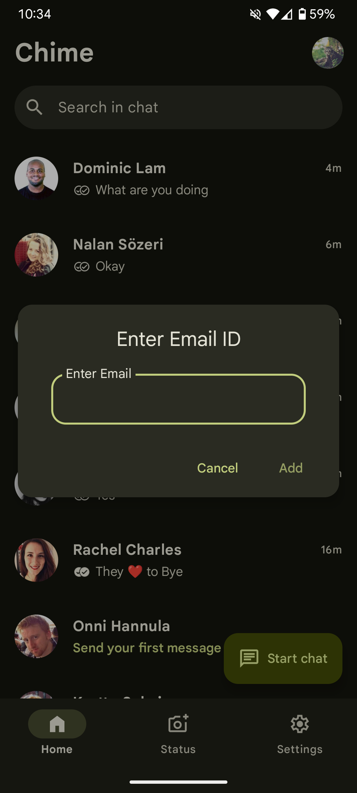

# **Chime**: Jetpack Compose Chatting App

A featured packed real-time chat application built using **Jetpack Compose** and **MVVM architecture**, showcasing modern Android development practices. The app includes functionalities such as real-time messaging, stories, typing indicators, read receipts, online presence, multimedia sharing, **Material You** dynamic theming using material you and many more.

---

## Screenshots

|  |  |  |  |
|-------------------------|-------------------------|-------------------------|-------------------------|
|  |  |  |  |

---

## Features

- **Jetpack Compose UI**: Built entirely using the modern declarative UI toolkit for Android.
- **MVVM Architecture**: Clean separation of concerns using ViewModel, Repository, and Firebase as backend.
- **User Authentication**: Firebase Authentication for secure sign-in and user management.
- **Real-time Chat**: Send and receive messages instantly.
- **Typing Indicator**: Real-time typing status between users.
- **Read Receipts**: Know when your messages are seen.
- **Online Indicator**: View online/offline status of users.
- **Stories**: Upload and view short-lived stories similar to modern chat apps.
- **Media Sharing**: Send and view images, videos, and documents.
- **Firestore and Storage Integration**: Scalable and real-time Google Cloud backend with cloud file storage.
- **Material You**: The colors of the app dynamically change according to your wallpaper colors and blend it with your liking.

---

## Architecture

The application follows a clean and scalable architecture pattern:

- **View**: Built with Jetpack Compose for reactive UI updates.
- **ViewModel**: Handles business logic and UI state management using Kotlin Coroutines and StateFlow.
- **Repository**: Manages data from Firebase Firestore, Firebase Storage, and Authentication modules.

---

## Tech Stack

- **Jetpack Compose**
- **Kotlin**
- **Firebase Firestore**
- **Firebase Authentication**
- **Firebase Storage**
- **Kotlin Coroutines**
- **StateFlow**
- **Navigation Compose**
- **Material 3**

---

## Demo Video

[Watch Demo Video](screenshots/video.mp4)

You can open this link to watch the demo video of the app.

---

## Download APK

[Download Chime.apk](Chime.apk)

This is the release build of the app. You can install it on your Android device to explore all the features.

---

## Resume Highlights

This project demonstrates:

- Full CRUD operations on user profiles, chats, stories, and media
- Practical implementation of MVVM and Compose in a real-world app
- Advanced UI/UX features such as chat indicators, status updates, and real-time syncing
- Integration of Firebase as a complete backend solution
- Clean state management using StateFlow and Coroutine scopes

---

## License

This project is licensed under the MIT License.
